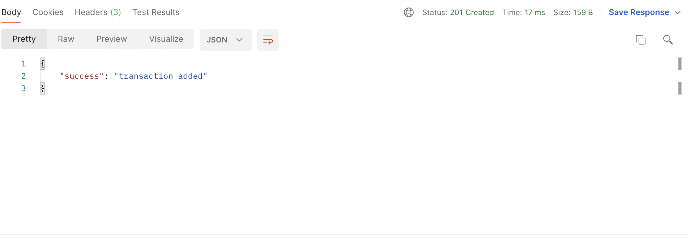
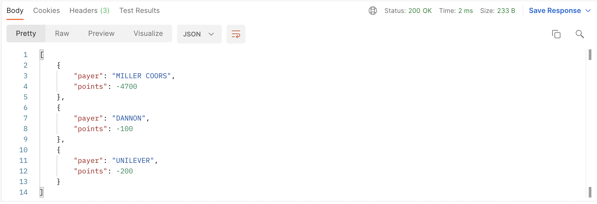
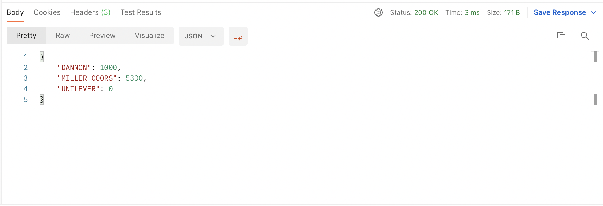

# FetchRewards-Takehome
This is a take home for FetchRewards backend engineering.

## Problem statement : <br>
Provide routes that: <br>
Add transactions for a specific payer and date. <br>
Spend points using the rules above and return a list of ​{ "payer": <string>, "points": <integer> }​ for each call. <br>
Return all payer point balances. <br>

## Installations : <br>
### Install Go in MacOS
``` $ brew update ``` <br>
``` $ brew install golang ``` <br>
This installs golang locally in your system.

### Install Go in Windows OS
Go to - [link](https://go.dev/) and download Golang. <br>
Check the go version with ``` go version ```. <br>
Check if gopath is set up correctly - [link](https://www.golinuxcloud.com/install-golang-on-windows/) <br>

### Steps to install project
``` $ git clone https://github.com/Ashwin1234/FetchRewards-Takehome ``` <br>
``` $ go mod download ``` <br>
This clones the project and installs all the dependencies. <br>

## Steps to run the project
To run the project use the follwing command in the project directory. <br>
``` $ go run main.go ``` <br>

## Steps to run the project using docker
To run the project using docker use the following command in the project directory. <br>
``` $ docker build . -t fetchrewards ``` <br>
``` $ docker run -d -p 8080:8080 fetchrewards ``` <br>
This first creates a docker image fetchrewards, and then runs the image in the container in port 8080.

The project should now be running in - [localhost:8080](http://localhost:8080)
<br>
<br>

## API endpoints and results

The endpoint - [http://localhost:8080/add_transactions](http://localhost:8080/add_transactions) is a POST request which add transactions.
the result is shown below.<br>


The endpoint - [http://localhost:8080/spend_points](http://localhost:8080/spend_points) is a GET request which gives the points spent by each user.<br>


The endpoint - [http://localhost:8080/point_balances](http://localhost:8080/point_balances) is a GET request which gives the point balances after the spent endpoint.<br>



## Running Tests
To run tests run the following command

``` go test```


